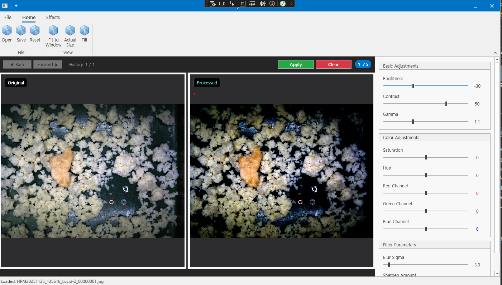

# Vision Algolism Viewer

**Vision Algolism Viewer**는 OpenCV 기반의 강력한 이미지 뷰어 및 편집 도구입니다. 
실시간 이미지 처리, 다양한 필터 효과, 히스토리 관리 기능을 제공합니다.
이 프로젝트는 개인 학습 및 업무 이미지 분석 목적으로 개발하였습니다.

## 주요 기능

### 이미지 뷰어
- **듀얼 뷰**: 원본 이미지와 처리된 이미지를 나란히 비교
- **픽셀 정보**: 마우스 오버 시 RGB, HSV 값 실시간 표시
- **다양한 표시 모드**: Fit to Window, Actual Size, Fill

### 기본 조정 (Basic Adjustments)
- **밝기 조정** (Brightness): -100 ~ +100
- **대비 조정** (Contrast): -100 ~ +100
- **감마 보정** (Gamma): 0.1 ~ 3.0

### 색상 조정 (Color Adjustments)
- **채도 조정** (Saturation): -100 ~ +100
- **색조 조정** (Hue): -180° ~ +180°
- **RGB 채널 개별 조정**: Red, Green, Blue 채널 독립 제어

### 필터 효과 (Effects)
- **Grayscale**: 흑백 변환
- **Sepia**: 세피아 톤
- **Negative**: 네거티브 효과
- **Blur**: 가우시안 블러 (시그마 조정 가능)
- **Sharpen**: 이미지 샤픈 (강도 조정 가능)
- **Median Filter**: 노이즈 제거
- **Edge Detection (Sobel)**: 소벨 엣지 검출
- **Edge Detection (Laplacian)**: 라플라시안 엣지 검출
- **Emboss**: 엠보스 효과
- **Box Blur**: 박스 블러

### Eye Reduction
- **Red Eye Reduction**: 플래시 촬영 시 발생하는 적목 현상 제거
- **Green Eye Reduction**: 녹색 눈 반사 제거
- **Blue Eye Reduction**: 청색 눈 반사 제거
- 각 효과별 Threshold 및 Level 조정 가능

### 히스토리 관리
- **이미지 컬렉션**: 최대 5개의 이미지 히스토리 관리
- **앞으로/뒤로 이동**: 이전/다음 이미지로 네비게이션
- **Apply 버튼**: 현재 처리된 이미지를 히스토리에 저장
- **Clear 버튼**: 히스토리 초기화 및 원본으로 복원

## 사용 방법
1. **이미지 열기**
   - File > Open 메뉴 또는 Open 버튼 클릭
   - 지원 형식: JPG, PNG, BMP, GIF, TIFF

2. **이미지 조정**
   - 우측 패널에서 원하는 조정 값을 슬라이더로 변경
   - 실시간으로 처리된 이미지 확인 (300ms 디바운싱 적용)

3. **효과 적용**
   - Effects 메뉴에서 원하는 효과 선택
   - 필터 파라미터 조정 가능 (Blur Sigma, Sharpen Amount 등)

4. **히스토리 관리**
   - Apply 버튼: 현재 처리 상태를 히스토리에 저장
   - Back/Forward 버튼: 이전/다음 상태로 이동
   - Clear 버튼: 모든 히스토리 삭제 및 원본으로 복원

5. **이미지 저장**
   - File > Save 메뉴 또는 Save 버튼 클릭
   - 지원 형식: PNG, JPG, BMP

**사용된 라이브러리**:
- OpenCvSharp4: Apache License 2.0
- DevExpress WPF Controls: Commercial License (별도 구매 필요)

